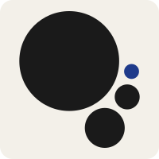
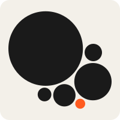
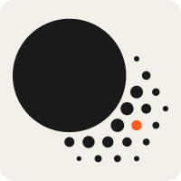
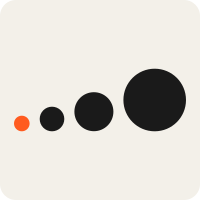
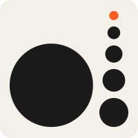
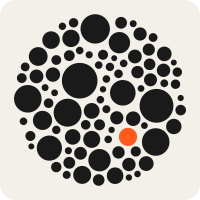

# Logo explorations

The dot\*WTF mark was chosen in September 2026 from seven directions drawn on a design canvas: [dot\*WTF logo explorations](https://claude.ai/artifact/9hKvWsxKBTkYVwtRQ4iCrc). It is private until shared from its Share menu. The SVGs in [assets/logo-explorations](assets/logo-explorations) are the same drawings, kept so any direction can be picked up again.

## Brief

dot\*WTF is the big dot. The dotts, every member, project and chapter, are smaller dots of varying sizes around it. Every candidate is built only from circles, in the site's ink on warm paper, with one accent dot for the newest dott.

## Chosen: Orbit

A big dot and three satellites that shrink as they go round it. Each satellite keeps the same gap from the big dot and from its neighbour, so the three trace an arc. It stays legible at 16px, where the busier directions turn to texture.

| Circle | Radius | Centre |
| --- | --- | --- |
| Big dot | 62.8 | 87.1, 76.8 |
| Satellite | 25.1 | 131.8, 160.9 |
| Satellite | 15.7 | 160, 121.9 |
| Newest dott, in the accent | 9.4 | 165.5, 89.9 |

Units are the mark's 200 × 200 viewBox. Radii run 1 : 0.4 : 0.25 : 0.15, and every gap is 7.3 units.

| Colour | Light | Dark |
| --- | --- | --- |
| Ink | `#1a1a1a` | `#eeeeec` |
| Accent, `--brand-accent` | navy `#1e3a8a` | `#819eee` |

Navy disappears on the dark background, so dark mode uses a lighter blue of the same hue.

The mark appears in:

- `components/brand-expansion-mark.tsx`: the "\*" in the site's `Wordmark`.
- `app/icon.svg`: the favicon, which follows the system colour scheme.
- `app/opengraph-image.png`: the link preview.
- `public/cwru-wtf-logo.svg`: the standalone mark.
- `public/dot-wtf-wordmark.svg` and `public/dot-wtf-wordmark-dark.svg`: the tekID sign-in logo, generated by `scripts/export-wordmark.swift`. The README's tekID section covers the Logto settings.

## Other directions

These used an orange placeholder for the accent dot.

| | Direction | Idea | Notes |
| --- | --- | --- | --- |
|  | Huddle | Smaller dots nestle against the big one. | Holds up at 16px. The closest alternative to Orbit. |
|  | Collective | A big centre dot with six dotts around it, two of them paired. | Went from 85 dots to 15 to 7; see below. Could be generated from the member list for posters or a members wall. |
|  | Dissolve | The big dot's edge breaks into a halftone of shrinking dots. | The halftone is lost below 32px. |
|  | Crescendo | Dot, dot, dot, DOT along a baseline. | Wide, so it is small in a square favicon. |
|  | Stem | A lowercase d: the big dot is the bowl and a column of rising dots the stem. | In a lockup it replaces the "d" of "dot". |
|  | Burst | The previous asterisk mark, rebuilt from dots. | Keeps continuity with the old identity. |

Collective iterations, from first to last:

  

## Changing the mark

Replace the circles in each file listed under Orbit. `scripts/export-wordmark.swift` also needs the new mark's visible bounds in `symbolBounds`; regenerate the wordmarks with `swift scripts/export-wordmark.swift`, then update both Logto logo fields.
